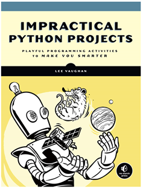

## Impractical Python
A plethora of projects based of the book *Impractical Python Projects: Playful Programming Activities to Make You Smarter* by Lee Vaughan.

Get the book [here](https://nostarch.com/impracticalpythonprojects) or contact me.

## Contents
* [x] Pseudonyms
* [x] Palindromes/ Palingrams
* [] Anagrams
