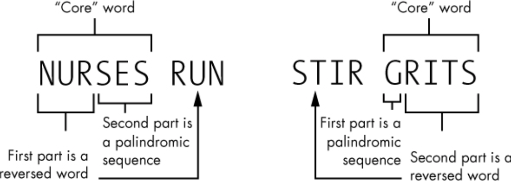

## Palingrams
“Radar. Kayak. Rotator. Sexes. What do these words all have in common? They’re palindromes, words that are spelled the same forward and backward. Even better are palingrams, whole phrases that behave the same way. Napoleon is the author of the most famous palingram. When he first saw Elba, the island of his exile, he said, “Able was I ere I saw Elba.”

Excerpt From: Lee Vaughan. “Impractical Python Projects: Playful Programming Activities to Make You Smarter”. Apple Books. 

## Part 1: Finding Palindromes
“You’ll start by finding single-word palindromes in a dictionary and then move on to the more difficult palindromic phrases.”

Excerpt From: Lee Vaughan. “Impractical Python Projects: Playful Programming Activities to Make You Smarter”. Apple Books. 

```sh
python palindromes.py
```

## Part 2: Finding Palingrams
“Use Python to search an English language dictionary for two-word palingrams. Analyze and optimize the palingram code using the cProfile tool.”

Excerpt From: Lee Vaughan. “Impractical Python Projects: Playful Programming Activities to Make You Smarter”. Apple Books. 

“Like palindromes, palingrams read the same forward and backward. I like to think of these as a core word, like nurses, from which a palindromic sequence and reversed word are derived ”

Excerpt From: Lee Vaughan. “Impractical Python Projects: Playful Programming Activities to Make You Smarter”. Apple Books. 



Our program will examine the core word based on the following inferences:
1. It can have either an odd or even number of letters.
2. One contiguous part of the word spells a real word when read backward.
3. This contiguous part can occupy part or all of the core word.
4. The other contiguous part contains a palindromic sequence of letters.
5. The palindromic sequence can occupy part or all of the core word.
6. The palindromic sequence does not have to be a real word (unless it occupies the whole word).
7. The two parts cannot overlap or share letters.
8. The sequence is reversible. 

There are two versions of this script.

1. Slow and unoptimized/ brute-force version `(On^2)` with searching of words from a list:

```sh
python palingrams.py
```
2. Optimized version `(On)` with searching of words from a hash set:

```sh
python palingrams_optimized.py
```